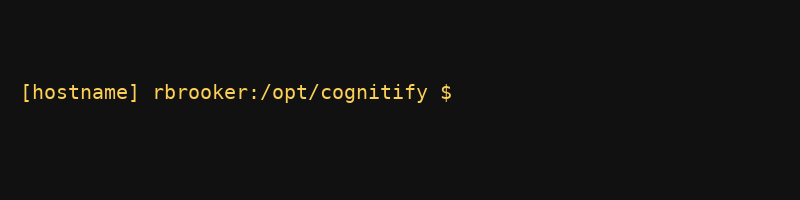

# Cognitify Fancy Prompt

Cognitify Fancy Prompt is a focused Linux shell customization package providing beautiful, customizable prompts and useful aliases. This branch focuses exclusively on prompt and alias functionality.

## What's in the box

- **Bash runtime fragments** (`src/bash.bashrc.d`): prompt and alias configurations intended for `/etc/bash.bashrc.d`.
- **User dotfiles** (`src/home-files`): templates for `.bashrc`, `.profile`, and `.over-ride` for prompt customization.
- **Color definitions** (`src/bash.bashrc.d/lib/cognitifyColours`): comprehensive color palette for prompt customization.

## Features

- **Customizable Prompt**: Colourful, informative prompt with hostname, username, and working directory
- **SUDO_USER Display**: Shows when using `sudo -u` to switch users
- **Root Warning**: Visual warning when running as root
- **WSL Support**: Special handling for Windows Subsystem for Linux
- **Useful Aliases**: Pre-configured aliases for common commands
- **User Overrides**: Easy customization via `~/.over-ride` file

## Installation

### Using the Install Script

Run the installer as root (or via `sudo`) from the repository root:

```bash
sudo bin/install.sh [--user <name>] [--all-users] [--update-skel] [--skip-user-files]
```

Flags:

- `--user <name>`: install dotfiles for a specific user (defaults to `SUDO_USER` or the invoking user).
- `--all-users`: install dotfiles for all existing users (UID >= 1000 or root).
- `--update-skel`: update `/etc/skel` so new users automatically get the configuration.
- `--skip-user-files`: skip installing user dotfiles (system-wide only).

What the installer does:

1. Creates required directories (`/etc/bash.bashrc.d/`, `/etc/prompts/`)
2. Installs system-wide bash configuration files with proper permissions (owned by `root:root`)
3. Optionally updates `/etc/skel` for new users (with `--update-skel`)
4. Copies user dotfiles (`.bashrc`, `.profile`, `.over-ride`) to:
   - A specific user (default or `--user`)
   - All existing users (with `--all-users`)
5. Backs up existing files to `.orig` (once)

**Note:** This installation does not create any system groups. Files are owned by `root:root` for system files and by the user for user-specific files.

### Using Ansible

See [ANSIBLE.md](ANSIBLE.md) for detailed Ansible deployment instructions.

Quick example:
```bash
ansible-playbook -i ansible-inventory install.yml
```

### User Self-Installation

If system-wide installation is already done but you want to add the dotfiles to your own account:

```bash
# From the repository directory
./src/bash.bashrc.d/cognitify-me.sh
```

Or if the script is installed system-wide:
```bash
# Copy the script to your home directory first
cp /etc/bash.bashrc.d/cognitify-me.sh ~/
chmod +x ~/cognitify-me.sh
~/cognitify-me.sh
```

This script:
- Only updates your personal dotfiles (no root required)
- Backs up existing files automatically
- Assumes system-wide files are already installed

## Customization

Customize your prompt by editing `~/.over-ride`. Available options:

- `OVERRIDE_HOSTNAME_COLOUR`: Colour for hostname display
- `OVERRIDE_USERNAME_COLOUR`: Colour for username display
- `OVERRIDE_PWD_COLOUR`: Colour for working directory
- `OVERRIDE_SUDO_USER_COLOUR`: Colour for SUDO_USER display (when using `sudo -u`)

Example:
```bash
export OVERRIDE_HOSTNAME_COLOUR=${BRIGHT_PINK}
export OVERRIDE_USERNAME_COLOUR=${LIME}
export OVERRIDE_PWD_COLOUR=${AZURE}
```

See `src/home-files/over-ride` for all available colour variables.

## Sample Prompt



Use this screenshot as a quick preview of how the Cognitify Fancy Prompt appears once installed.

## Version

Current version: `0.2.0-fancy-prompt`

Version information is available via the `COGNITIFY_VERSION` environment variable.

## Maintenance

- Repository version is tracked in `version`
- User-specific customizations should be placed in `~/.over-ride`

## Installation Impact

For detailed information about what happens to your system during installation, see [INSTALLATION_IMPACT.md](INSTALLATION_IMPACT.md).

This document covers:
- Files and directories created
- Permissions and ownership changes
- Backup behavior
- Environment variables set
- Rollback procedures
- What does NOT happen

(c) 2026 Ramon Brooker <rbrooker@aeo3.io>
